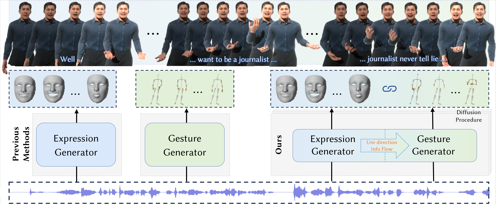

<div align="center">

## <b>DiffSHEG</b>: A Diffusion-Based Approach for Real-Time Speech-driven Holistic 3D Expression and Gesture Generation 
(CVPR 2024 Official Repo)

[Junming Chen](https://jeremycjm.github.io)<sup>&dagger;1,2</sup>, [Yunfei Liu](http://liuyunfei.net/)<sup>2</sup>, [Jianan Wang](https://scholar.google.com/citations?user=mt5mvZ8AAAAJ&hl=en&inst=1381320739207392350)<sup>2</sup>, [Ailing Zeng](https://ailingzeng.site/)<sup>2</sup>, [Yu Li](https://yu-li.github.io/)<sup>*2</sup>, [Qifeng Chen](https://cqf.io)<sup>*1</sup>

<p><sup>1</sup>HKUST &nbsp;&nbsp;<sup>2</sup>International Digital Economy Academy (IDEA) &nbsp;&nbsp;
<br><sup>*</sup>Corresponding authors &nbsp;&nbsp;<sup>&dagger;</sup>Work done during an internship at IDEA<p>

#### [Project Page](https://jeremycjm.github.io/proj/DiffSHEG/) · [Paper](https://arxiv.org/abs/2401.04747) · [Video](https://www.youtube.com/watch?v=HFaSd5do-zI)

</div>



## Environment
We have tested on Ubuntu 18.04 and 20.04.
```
cd assets
```
- Option 1: conda install
```
conda env create -f environment.yml
conda activate diffsheg
```
- Option 2: pip install
```
conda create -n "diffsheg" python=3.9
conda activate diffsheg
pip install -r requirements.txt
pip install torch==1.13.1+cu117 torchvision==0.14.1+cu117 torchaudio==0.13.1 --extra-index-url https://download.pytorch.org/whl/cu117
```
- Untar data.tar.gz for data statistics
```
tar zxvf data.tar.gz
mv data ../
```

## Checkpoints
[Google Drive](https://drive.google.com/file/d/1JPoMOcGDrvkFt7QbN6sEyYAPOOWkVN0h/view)

## Inference on a Custom Audio
First specify the '--test_audio_path' argument to your test audio path in the following mentioned bash files. Note that the audio should be a .wav file.

- Use model trained on BEAT dataset:
```
bash inference_custom_audio_beat.sh
```

- Use model trained on SHOW dataset:
```
bash inference_custom_audio_talkshow.sh
```
## Training
<details><summary>Train on BEAT dataset</summary>

```
PYTHONPATH="$(dirname $0)/..":$PYTHONPATH \
OMP_NUM_THREADS=10 CUDA_VISIBLE_DEVICES=0,1,2,3,4 python -u runner.py \
    --dataset_name beat \
    --name beat_diffsheg \
    --batch_size 2500 \
    --num_epochs 1000 \
    --save_every_e 20 \
    --eval_every_e 40 \
    --n_poses 34 \
    --ddim \
    --multiprocessing-distributed \
    --dist-url 'tcp://127.0.0.1:6666'
```
</details>


<details><summary>Train on SHOW dataset</summary>

```
PYTHONPATH="$(dirname $0)/..":$PYTHONPATH \
OMP_NUM_THREADS=10 CUDA_VISIBLE_DEVICES=0,1,2,3,4 python -u runner.py \
    --dataset_name talkshow \
    --name talkshow_diffsheg \
    --batch_size 950 \
    --num_epochs 4000 \
    --save_every_e 20 \
    --eval_every_e 40 \
    --n_poses 88 \
    --classifier_free \
    --multiprocessing-distributed \
    --dist-url 'tcp://127.0.0.1:6667' \
    --ddim \
    --max_eval_samples 200
```
</details>

## Testing

<details><summary>Test on BEAT dataset</summary>

```
PYTHONPATH="$(dirname $0)/..":$PYTHONPATH \
OMP_NUM_THREADS=10 CUDA_VISIBLE_DEVICES=0,1,2,3,4,5,6,7 python -u runner.py \
    --dataset_name talkshow \
    --name talkshow_GesExpr_unify_addHubert_encodeHubert_mdlpIncludeX_condRes_LN_ClsFree \
    --PE pe_sinu \
    --n_poses 88 \
    --multiprocessing-distributed \
    --dist-url 'tcp://127.0.0.1:8889' \
    --classifier_free \
    --cond_scale 1.25 \
    --ckpt ckpt_e2599.tar \
    --mode test_arbitrary_len \
    --ddim \
    --timestep_respacing ddim25 \
    --overlap_len 10
```
</details>


<details><summary>Test on SHOW dataset</summary>

```
PYTHONPATH="$(dirname $0)/..":$PYTHONPATH \
OMP_NUM_THREADS=10 CUDA_VISIBLE_DEVICES=0,1,2,3,4,5,6,7 python -u runner.py \
    --dataset_name talkshow \
    --name talkshow_GesExpr_unify_addHubert_encodeHubert_mdlpIncludeX_condRes_LN_ClsFree \
    --PE pe_sinu \
    --n_poses 88 \
    --multiprocessing-distributed \
    --dist-url 'tcp://127.0.0.1:8889' \
    --classifier_free \
    --cond_scale 1.25 \
    --ckpt ckpt_e2599.tar \
    --mode test_arbitrary_len \
    --ddim \
    --timestep_respacing ddim25 \
    --overlap_len 10
```
</details>

## Visualization
After running under the test or test-custom-audio mode, the Gesture and Expression results will be saved in the ./results directory.
### BEAT
1. Open ```assets/beat_visualize.blend``` with latest Blender on your local computer.
2. Specify the audio, BVH (for gesture), JSON (for expression), and video saving path in the transcript in Blender.
3. (Optional) Click Window --> Toggle System Console to check the visulization progress.
4. Run the script in Blender.
### SHOW
Please refer the the [TalkSHOW](https://github.com/yhw-yhw/TalkSHOW) code for the visualization of our generated motion.

## Acknowledgement
Our implementation is partially based on [BEAT](https://github.com/PantoMatrix/BEAT), [TalkSHOW](https://github.com/yhw-yhw/TalkSHOW), and [MotionDiffuse](https://github.com/mingyuan-zhang/MotionDiffuse/tree/main).

## Citation
If you use our code or find this repo useful, please consider cite our paper:
```
@inproceedings{chen2024diffsheg,
  title     = {DiffSHEG: A Diffusion-Based Approach for Real-Time Speech-driven Holistic 3D Expression and Gesture Generation},
  author    = {Chen, Junming and Liu, Yunfei and Wang, Jianan and Zeng, Ailing and Li, Yu and Chen, Qifeng},
  booktitle = {CVPR},
  year      = {2024}
}
```


